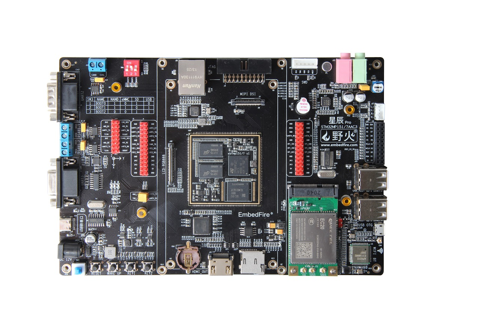
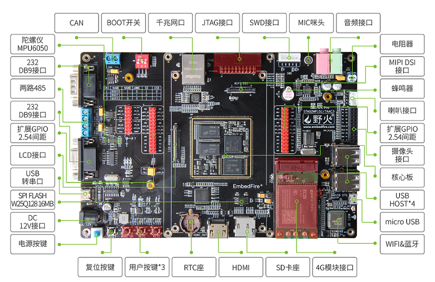

.. vim: syntax=rst

EBFMP157 Pro底板硬件手册
==========================================

资料下载
------------------------

============  ====================
内容            下载链接
============  ====================
硬件原理图     :download:`野火_EBFMP157 S1 Pro 底板_原理图.pdf <../../hardware/EBFMP157 S1 Pro/ebf_mp157 s1 dev board_20210223_原理图.pdf>`
机械尺寸图     :download:`野火_EBFMP157 S1 Pro 底板_机械尺寸.pdf <../../hardware/EBFMP157 S1 Pro/ebf_mp157 dev board s1_20210223_机械尺寸.pdf>`
封装库         :download:`野火_EBFMP157 S1 Pro 底板_封装库.zip <../../hardware/EBFMP157 S1 Pro/封装库/封装库.zip>`
============  ====================

产品概述
------------------------

EBFMP157 S1 Pro开发板是野火电子基于STM32MP157系列处理器设计的一款低功耗单板电脑，
主频为650MHz，具体如下图。

EBFMP157 S1 Pro开发板提供完整的SDK驱动开发包、核心板封装库，底板应用参考设计原理图，
可帮助客户大大缩减产品的开发时间，加快产品上市。
目前提供Linux 4.19.94版本的内核，配套的系统自带python、Qt等组件。

开发板整板由EBFMP157 S1核心板模组和底板组成，元件采用工业级选料，
其中核心板板载主控芯片1GB DDR3L内存，8GB eMMC。

配套的核心板说明见《:doc:`ebfmp157s1`》

EBFULL Pro底板硬件资源
------------------------

野火EBFMP157 Pro底板硬件资源见图：

EBFMP157 S1 Pro底板硬件资源表：

============ ============================================================================================
尺寸         200*13.5MM
PCB          2层、黑色沉金
\
DC12V 接口   DC 12V@2A 直流输入，不支持电脑USB供电，因为电流不够
USB转串口    使用MiniUSB接口，使用CH340驱动
KEY          RESET 1个，WAKEUP 1个，自定义2个
RGB灯        由三个独立的小灯组成
六轴陀螺仪   型号MPU6050
DB9接口      2路，1路母头DB9，1路公头DB9，使用RS232协议
485接口      2路，2线接线柱引出， 使用RS485协议
CAN接口      1路，2线接线柱引出 ，使用CAN协议
启动配置     通过1个3位的拨码开关配合实现
以太网       1路一路千兆以太网，型号RTL8211F
JTAG接口     1个，使用2*10P 2.54间距牛角座引出
音频接口     1x LINE IN，3.5mm音频座；1x LINE OUT，3.5mm音频座；1x MIC IN，电容咪头，使用WM8960编解码芯片
喇叭接口     1x4p XH2.0接口引出，可用型号：3080
摄像头接口   可直接配套野火OV5640摄像头
蜂鸣器       有源蜂鸣器，3.3V驱动
USB HOST     4路通过芯片原生外扩，A型母座双层USB接口
电位器       1K阻值变动
micro USB    原生引出，支持OTG
RTC座子      电池座，适用电池型号CR1220
WIFI&蓝牙    型号：AP6236
SD卡座       microSD卡卡座
HDMI接口     RGB转HDMI
LCD接口      FPC接口，RGB888及I2C触摸信号，支持直接连接野火的5寸/7寸/4.3寸屏
MIPI接口     FPC接口，DSI及I2C触摸信号
============ ============================================================================================
